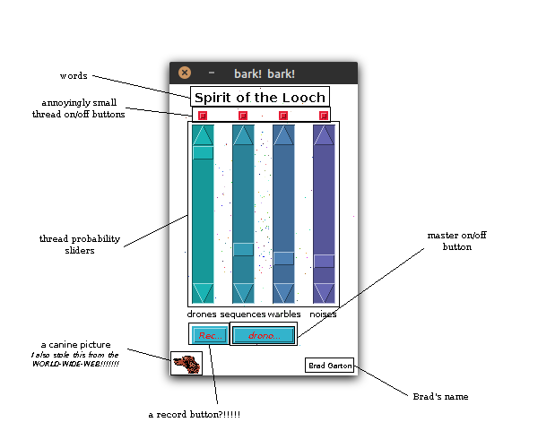

# jlooch-neo

Based on the work by [Brad Garton](http://sites.music.columbia.edu/brad/jlooch/). A copy of the back-end of the original JLooch (with minor modifications for the new front-end) and a Java Swing/AWT front-end.

This application creates ambient, droning sounds which are great as background noise or to help you relax.

# Requirements

## Java

You will need Java installed to build and run this application. Works with `openjdk 11.0.13` or newer.

## Gradle

Gradle is used as the build tool for this application. The version I used is `Gradle 7.3.3`. Should work with that or newer. Older versions may work as well.

## Web Connection

Well, if you're reading this, it probably won't be an issue! The `jsyn_16_7_0.jar` must be downloaded from `www.softsynth.com` since that library is not packaged with this code.

# How to Build / Run

To build `jlooch-neo`, use your local Gradle installation or use the provided Gradle Wrapper:

`gradle clean build`

or

`./gradlew clean build`

To run the application, run it as a Java jar:

`java -jar build/libs/jlooch-neo.jar`

## Legacy UI

The code also includes the original UI. To run the application with that, select the jlooch Class or set `Main-Class` to `jlooch.jlooch` in `build.gradle`.

# What the buttons and sliders do

* <ins>*The Annoyingly-Small Thread on/off Buttons:*</ins>

These buttons turn on and off various sound-producing threads in java. With most desktops/laptops on the market these days, the number of threads shouldn't be a concern, but consider messing around with the settings if you notice performance issues!

Of course, these little buttons are also useful if you really can't stand some of the sounds.

The button in the red/+ state () means the thread is running; in the bluegreen/- state () the thread is stopped. 

* <ins>*The Thread Probability Sliders:*</ins>

These sliders control the probability that certain sound events will occur. At the top of the slider range, the probability is 1.0. At the bottom, it just won't happen (probability = 0.0). Bear in mind that because of the slowness of events in this soundscape, you probably won't hear these sliders have an immediate effect. In fact, even when the probability is set to 1.0 nearly all the events have about a 5-10 second interval between them. Patience is, of course, a great virtue.

The defaults provided in this version are the same as in the original linked above.

* <ins>*The Master on/off Button:*</ins>

Well gawrsh, I done fergot what this one does. Shucks.

* <ins>*The Record Button:*</ins>

Click this button to start recording those sweet droney sounds. Click again to stop.

## Record Button Functionality

This version of JLooch includes a record button. If you press the button while sound is playing, it will begin to record the audio being played by the app until you stop the recording or close the app. The raw sound data will be recorded in the root folder of the app in the file `looch.wav`. The audio is recorded at a sample rate of 44100, so it will fill up your hard drive if you leave it recording for a long time. Make sure you have enough space! New recordings will overwrite existing ones, so be sure to move any recording you like to a new location before starting a new one!

# Known Bugs

The label text on the annoyingly-small toggle buttons appears to be misaligned.